# BetterSelf.AI - AI Habit Building App (Prototype)

A fully clickable MVP prototype of an AI-powered habit-building platform that helps users become their best version through personalized daily plans, stage-based task unlocking, and reflective check-ins.

🔗 [View Interactive Prototype](https://alive-sauna-07860797.figma.site)

---

## The Problem

Everyone wants to improve but most people lack clear direction and consistent discipline. External motivation fades within days. Generic routines don't stick because they don't account for individual lifestyle, stress levels, or energy patterns.

---

## The Solution

BetterSelf.AI analyzes your current lifestyle through a short onboarding quiz and builds a fully personalized daily routine from scratch. Users complete tasks, upload proof, and unlock the next stage — creating a progressive, gamified growth journey.

---

## User Personas

**Mohit, 25**: wants to get in shape but lacks discipline and consistency.

**Sneha, 23**: struggles to balance job, gym, and household chores. Ends up anxious and burnt out.

---

## Core User Flow

### 1. Sign Up
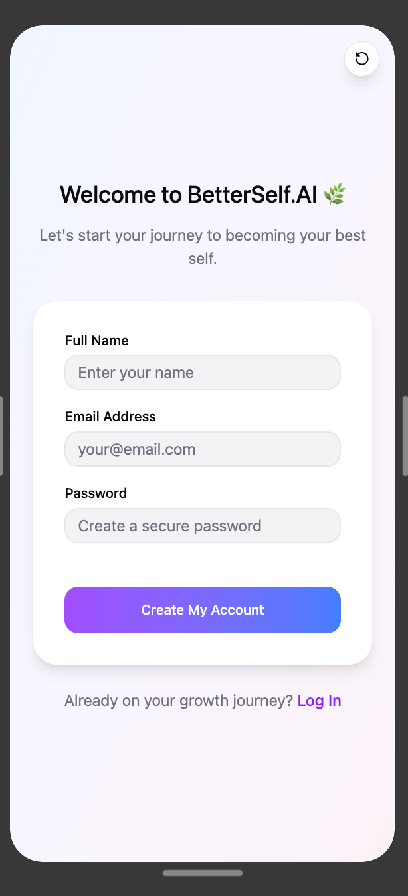

### 2. How It Works
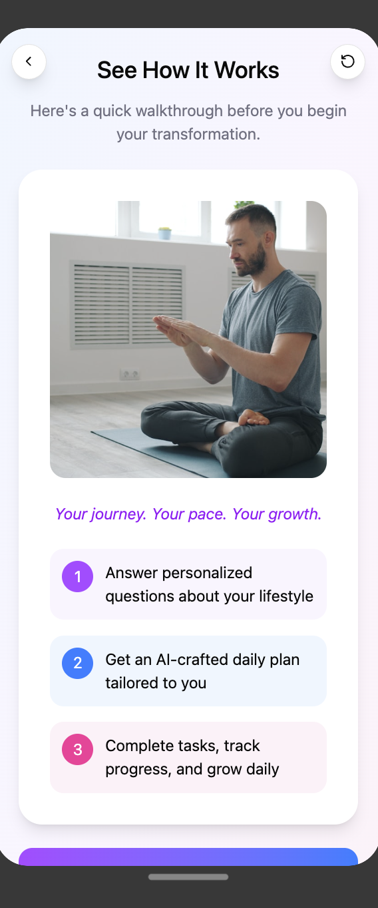

### 3. Onboarding Start
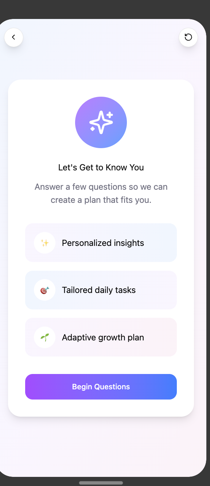

### 4–8. Personalization Questions
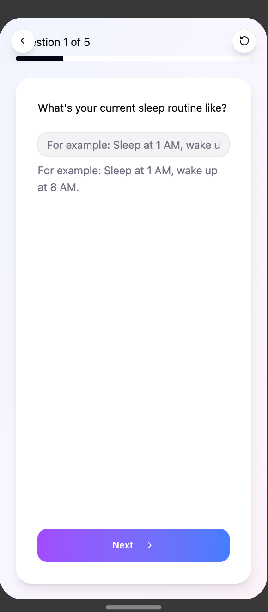
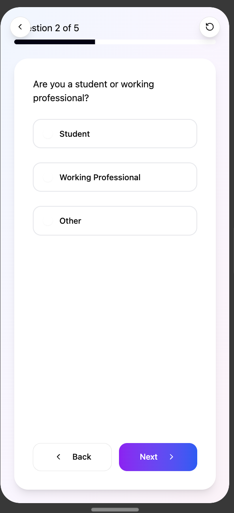
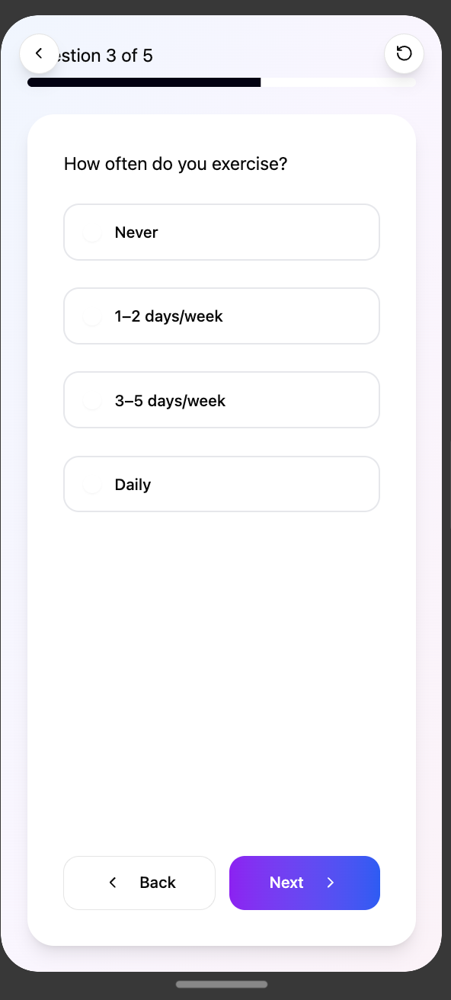
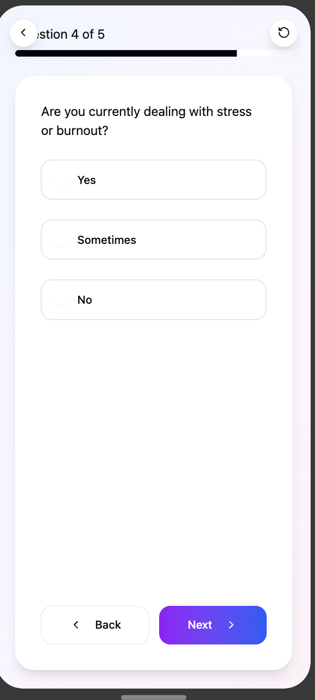
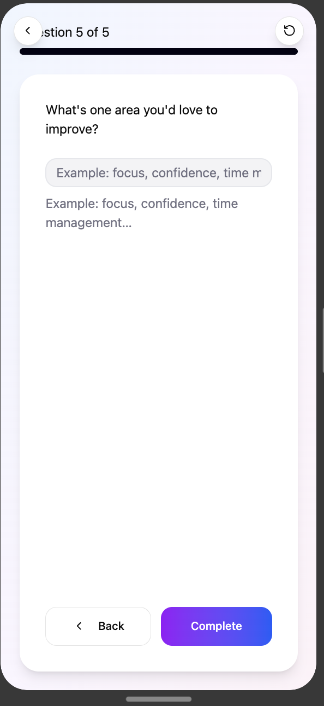

### 9. AI Builds Your Plan
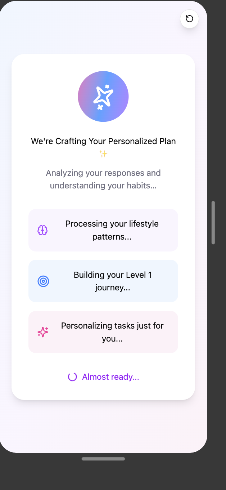

### 10. Your Personalized Plan is Ready
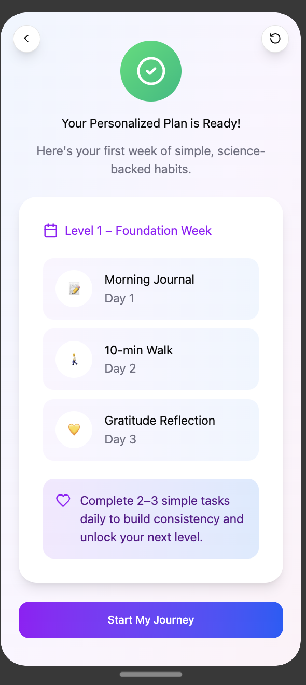

### 11. Foundation Week — Stage View
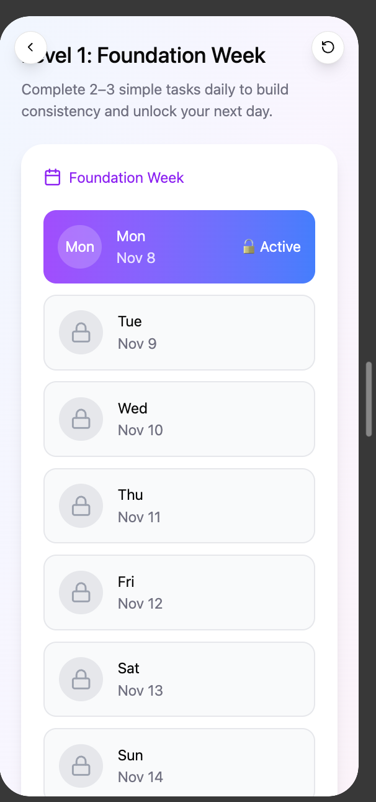

### 12. Daily Tasks
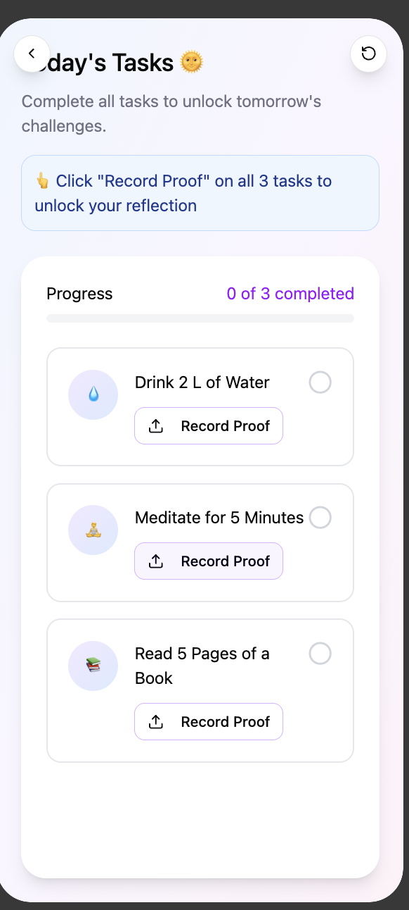

### 13. Tasks Completed
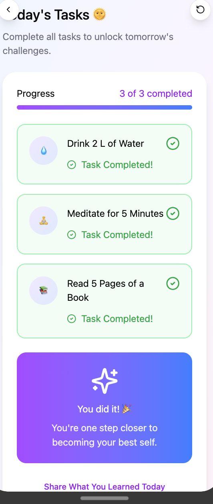

### 14. Reflection Check-in
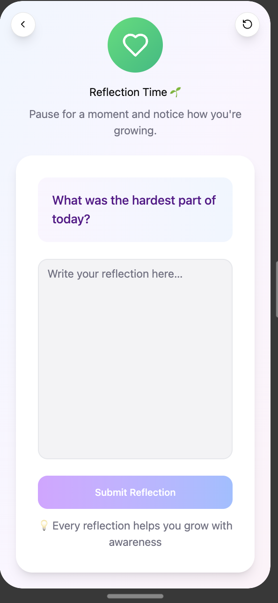

### 15. Journey Complete
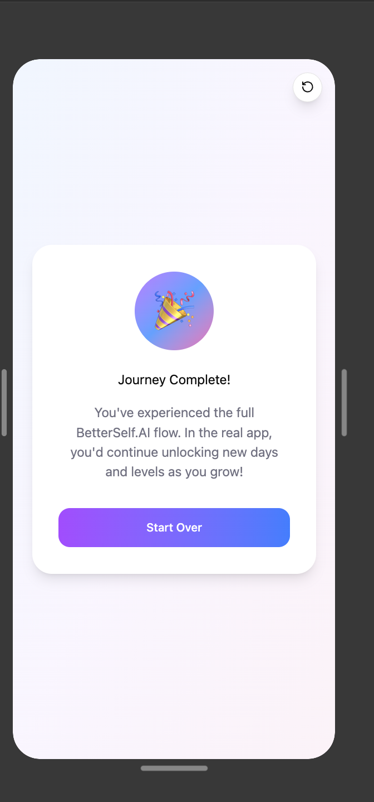

---

## Key Features

**AI-personalized onboarding**: 5 questions about sleep, profession, exercise habits, stress levels, and growth goals. AI builds a unique routine for each user.

**Stage-based progression**: Users unlock the next day only after completing all tasks. Completing Stage 1 unlocks Stage 2, with increasing difficulty over time.

**Proof-based task verification**: Users record a short video clip per task. Timestamp verification prevents cheating and adds friction to ensure honesty.

**Reflective check-ins**: After every 3–5 tasks, AI asks a 30-second reflection question. Users cannot progress without answering, ensuring honest engagement.

**Guilt-free rest days**: System accounts for energy levels, menstrual cycle phases, and burnout patterns to suggest rest when needed.

## Prompt Engineering

- Designed AI prompts to analyze user responses across 5 dimensions 
  (sleep, profession, exercise, stress, goals) and generate a 
  fully personalized weekly routine
- Engineered prompts to produce structured task output with 
  correct difficulty progression across stages
- Designed reflective check-in prompts to gather honest user 
  feedback without feeling like a survey
- Iterated prompts to ensure consistent, non-generic output 
  for different user persona combinations

---

## MVP Success Metrics

| Metric | Purpose |
|---|---|
| DAU / MAU | Track daily and monthly active users |
| Retention Rate | How many users return after day 1, day 7, day 30 |
| Churn Rate | Understand what's not working |
| Streak Completion Rate | Are users finishing their daily tasks |
| Net Promoter Score | Customer satisfaction via reflective check-ins |

---

## Business Model

AI-SaaS B2C: Free to start, with a freemium model introduced as user base grows. Paid tier offers deeper personalization, advanced analytics, and flexible scheduling.

---

## Go-To-Market Strategy

**Target users**: Corporate professionals aged 20–31 seeking work-life balance. Students preparing for competitive exams.

**Channels**: Instagram, YouTube, LinkedIn, Discord communities, Reddit.

**Influencer marketing**: Mental health coaches and productivity coaches.

**Launch plan:**
1. Soft launch to coaches — gather feedback
2. Improve based on feedback — launch via social media campaigns
3. Scale via influencer marketing and A/B testing

---

## Future Roadmap

- Paid tier for deeper AI personalization
- Flexible scheduling (daily, weekly, or custom cadence)
- Context-aware photo verification (AI analyzes image content for authenticity)
- Weekly AI-generated progress summaries

---

## Tools Used

| Tool | Purpose |
|---|---|
| Figma | UI design and interactive prototype |

---

## Project structure

| File | Description |
|---|---|
| 01-signup.png | Sign up screen |
| 02-how-it-works.png | App walkthrough screen |
| 03-onboarding-start.png | Onboarding intro screen |
| 04-question-sleep.png | Sleep routine question |
| 05-question-profession.png | Student or professional question |
| 06-question-exercise.png | Exercise frequency question |
| 07-question-stress.png | Stress and burnout question |
| 08-question-improve.png | Improvement area question |
| 09-ai-processing.png | AI building the plan |
| 10-plan-ready.png | Personalized plan revealed |
| 11-foundation-week.png | Foundation week stage view |
| 12-daily-tasks.png | Daily tasks screen |
| 13-tasks-completed.png | All tasks completed screen |
| 14-reflection.png | Reflective check-in screen |
| 15-journey-complete.png | End of prototype screen |
| README.md | Project documentation |
---

## Author

Built by Anshika Gupta · https://www.linkedin.com/in/anshika-gupta1008/ · https://github.com/AnshikaGupta0124
